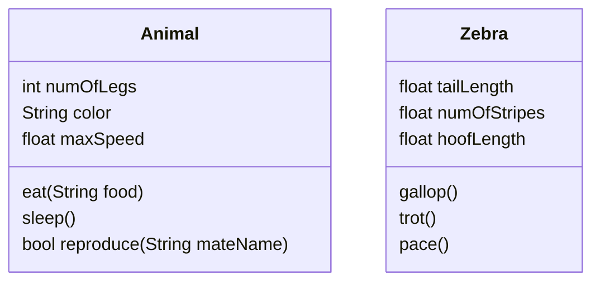

# UML Diagram for Space Program

Assignment: UML Diagram for UAT Space Program

Create a UML diagram with 2 classes with 3 attributes and 3 methods each

```mermaid
    classDiagram
    class Animal{
        int numOfLegs
        String color
        eat(String food)
        float maxSpeed
        sleep()
        bool reproduce(String mateName)
    }

    class Zebra{
        float tailLength
        float numOfStripes
        float hoofLength
        gallop()
        trot()
        pace()
    }

```