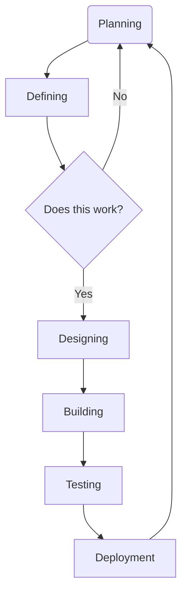

# Flowchart for SDLC

this is the SDLC cycle

```mermaid
    flowchart
    A(Planning) --> B
    B[Defining] --> C2
    C[Designing] --> D
    D[Building] --> E
    F[Deployment] --> A
    E[Testing] --> F
    C2{Does this work?} -->|Yes| C
    C2 -->|No| A
```